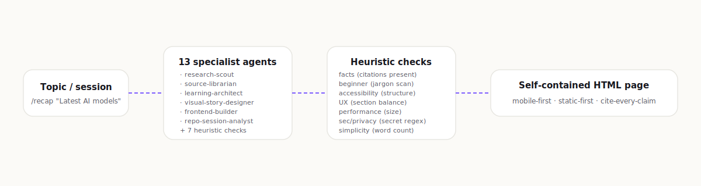

<picture>
  <source media="(prefers-color-scheme: dark)" srcset=".github/assets/logo-dark.svg">
  <source media="(prefers-color-scheme: light)" srcset=".github/assets/logo-light.svg">
  
</picture>

<p align="center">
  <a href="LICENSE"></a>
  <a href="https://github.com/Aboudjem/recap-studio/actions/workflows/ci.yml"></a>
  <a href="https://nodejs.org"></a>
  <a href="https://github.com/Aboudjem/recap-studio/stargazers"></a>
</p>

<p align="center"><b>Visual, mobile-first, ADHD-friendly one-page explainers in under 5 minutes.</b></p>

<p align="center">
  <a href="#get-started">Get started</a> ·
  <a href="#what-it-does">What it does</a> ·
  <a href="#how-it-works">How it works</a> ·
  <a href="#quality-bar">Quality bar</a> ·
  <a href="docs/architecture.md">Docs</a>
</p>

<picture>
  
</picture>

---

## Get started

```bash
git clone https://github.com/Aboudjem/recap-studio
cd recap-studio
pnpm install
pnpm -w demo:latest-ai-models
pnpm -w validate:demo
pnpm --filter recap-web dev   # http://localhost:3000
```

That regenerates the offline fixture, validates it across 7 dimensions, and
serves the page locally. Zero network calls. Zero paid API hits.

### Install as a Claude Code plugin

<details>
<summary><b>Claude Code (via the 10x marketplace)</b></summary>

```bash
claude plugin marketplace add Aboudjem/10x
claude plugin install recap-studio@10x
```

Then in any session:

```
/recap "Latest AI models"
/recap session
/recap setup
/recap validate
```
</details>

<details>
<summary><b>Cursor / Codex / Windsurf / Continue.dev</b></summary>

Recap Studio is a Claude Code plugin. The renderer and validator still work
in any editor — clone the repo, run `pnpm install`, and call:

```bash
node scripts/demo-latest-ai-models.mjs
node scripts/validate.mjs
node scripts/history.mjs
```

The Next.js page is fully static-first and editor-agnostic.
</details>

---

## Usage

| Command                              | What it does                                            |
| ------------------------------------ | ------------------------------------------------------- |
| `pnpm -w demo:latest-ai-models`      | Generate the offline demo page                          |
| `pnpm -w validate:demo`              | Score the active page across 7 dimensions               |
| `pnpm -w history`                    | List every recap in `artifacts/` with scores            |
| `pnpm -w auto-refresh -- <slug>`     | Re-validate a stored recap (cron-friendly)              |
| `pnpm --filter recap-web dev`        | Preview the page on localhost:3000                      |
| `pnpm --filter recap-web build`      | Build the static site                                   |
| `pnpm deploy:preview`                | Vercel preview deploy (gated by config + env)           |
| `pnpm deploy:prod`                   | Vercel production deploy (double-gated)                 |

In Claude Code:

| Command                  | What it does                                          |
| ------------------------ | ----------------------------------------------------- |
| `/recap "<topic>"`       | Build a full explainer page from a topic              |
| `/recap session`         | Explain a coding session from `git diff` + commits    |
| `/recap session --deep`  | Same, with a per-file deep-dive accordion             |
| `/recap setup`           | Create `recap-studio.config.ts` with safe defaults    |
| `/recap validate`        | Re-score the active page                              |

---

## What it does

Recap Studio turns a topic or a coding session into an opinionated one-page
website that a smart 18-year-old can read in 5 minutes:

| Section            | Why it exists                                                |
| ------------------ | ------------------------------------------------------------ |
| Hero               | One-sentence answer, not a wall of text                      |
| What matters       | 3 takeaways before any deep dive                             |
| Concept map        | A real diagram, not decoration                               |
| Key ideas (cards)  | 4 to 7 short cards, never paragraphs                         |
| Timeline           | Only if there is a real chronology                           |
| Comparison         | Side-by-side, table on md+, stacked cards on mobile          |
| Examples + analogies | Concrete first, abstractions second                        |
| Misconceptions     | Myth vs truth split cards                                    |
| Glossary           | Plain English, expandable                                    |
| Practical takeaways | Things a reader can do today                                |
| Sources            | Every important claim cites a source                         |
| Confidence notes   | Marks uncertainty instead of papering over it                |

---

## How it works

```
Claude Code plugin
└─ skills (recap-topic, recap-session, recap-setup, recap-validate)
   └─ 13 specialist subagents (research → synthesis → 7 parallel reviewers)
      └─ packages/ (content-pipeline, design-system, validation, mcp-server)
         └─ apps/recap-web (Next.js 15 App Router, RSC, force-static)
```

Each agent passes typed JSON, never raw context. Reviewers run in parallel
and only failing dimensions trigger a patch pass. See
[`docs/architecture.md`](docs/architecture.md) for the full picture.

### v0.2 features

| Feature                | What it adds                                                       |
| ---------------------- | ------------------------------------------------------------------ |
| Run history dashboard  | `pnpm -w history` lists every recap with score + blockers          |
| Multi-language scaffold | 6 locales pre-wired (en/fr/es/de/pt/ja) for UI strings             |
| RAG source vault       | Keyword search across the JSONL source cache                       |
| Auto-refresh           | `pnpm -w auto-refresh -- <slug>` re-validates a recap (cron-ready) |
| Template marketplace   | `templates/` directory with `tech-explainer` + `coding-session`    |
| Human review mode      | `humanReviewMode: "off" \| "before-publish" \| "before-deploy"`    |
| Reader analytics       | Privacy-friendly local-only counters, opt-in                       |

---

## Quality bar

Every generated page must hit these targets. The demo page scores **9.7/10**
overall and passes every threshold.

| Facts | Beginner | ADHD | UX | Performance | Security | Simplicity |
| ----- | -------- | ---- | -- | ----------- | -------- | ---------- |
| ≥ 9   | ≥ 9      | ≥ 9  | ≥ 8| ≥ 8         | ≥ 9      | ≥ 9        |

If a dimension drops, the validator marks it `WARN` or `FAIL` and the
orchestrator runs a targeted patch.

---

## Safety defaults

Every side effect is **off by default** and gated by config + explicit
confirmation:

- No network. `RECAP_STUDIO_FIXTURE_ONLY=1` is the canonical starting state.
- No deploys. `deploymentMode: "disabled"`.
- No emails. `emailMode: "disabled"`.
- No secret writes. Hooks refuse `.env*`, PEMs, and key-shaped paths.
- No destructive git. Hooks refuse `push`, `reset --hard`, `rebase`,
  `clean -fdx`.

Hook overrides require human review. See
[`docs/security-and-privacy.md`](docs/security-and-privacy.md).

---

## Docs

- [Architecture](docs/architecture.md)
- [Agent system](docs/agent-system.md)
- [Workflows](docs/workflows.md)
- [Vercel deployment](docs/vercel-deployment.md)
- [Security and privacy](docs/security-and-privacy.md)
- [Configuration](docs/configuration.md)
- [Contributing](CONTRIBUTING.md)
- [Changelog](CHANGELOG.md)
- [GOAL_SPEC.md](GOAL_SPEC.md) — the canonical spec

---

## Contributing

PRs welcome. The bar is high but the rules are short. See
[CONTRIBUTING.md](CONTRIBUTING.md).

---

<p align="center">
  If Recap Studio helped you ship a better explainer, star it.<br/>
  It helps other devs find tools that respect their attention.
</p>

<p align="center">
  <a href="https://www.linkedin.com/in/adam-boudjemaa/"></a>
  <a href="https://x.com/AdamBoudj"></a>
  <a href="https://adam-boudjemaa.com/"></a>
</p>

<p align="center">
  <sub>Built by <a href="https://github.com/Aboudjem">Adam Boudjemaa</a> · MIT License · No telemetry · No data collection</sub>
</p>
