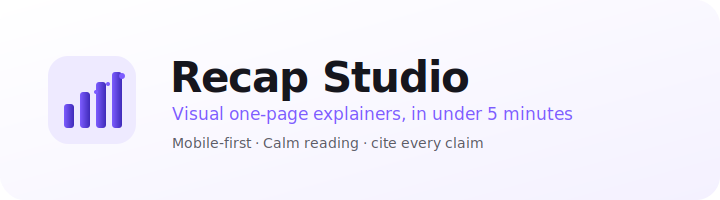
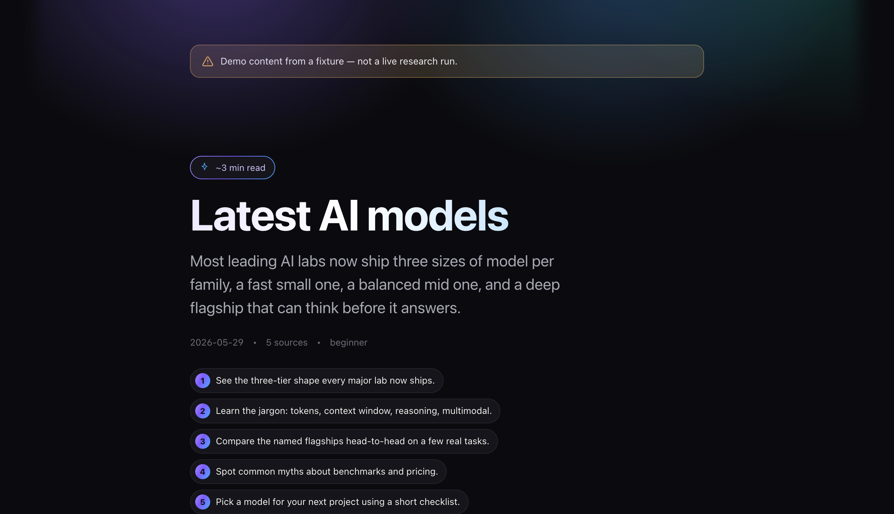
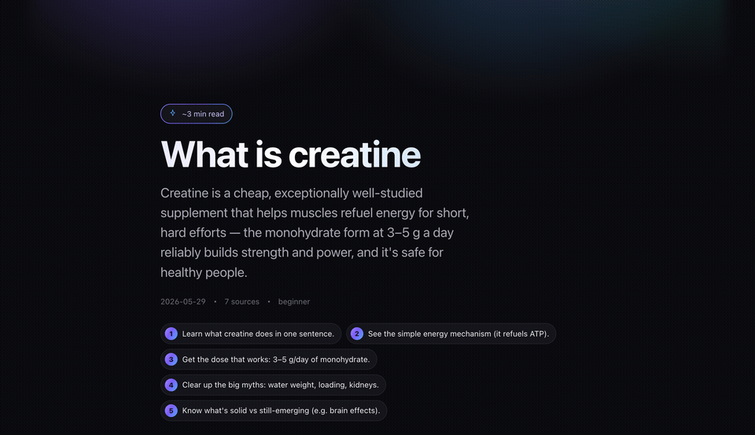

<picture>
  <source media="(prefers-color-scheme: dark)" srcset=".github/assets/logo-dark.svg">
  <source media="(prefers-color-scheme: light)" srcset=".github/assets/logo-light.svg">
  
</picture>

<p align="center">
  <a href="https://github.com/Aboudjem/recap-studio/releases"></a>
  <a href="LICENSE"></a>
  <a href="https://github.com/Aboudjem/recap-studio/actions/workflows/ci.yml"></a>
  <a href="https://nodejs.org"></a>
  <a href="https://github.com/Aboudjem/10x"></a>
  <a href="https://github.com/Aboudjem/recap-studio/stargazers"></a>
</p>

<p align="center"><b>Turn any topic or coding session into a beautiful, dark-mode, mobile-first explainer you can double-click to open. No server, no internet, no dependencies.</b></p>

<p align="center">
  <sub>Self-contained offline HTML · sans-serif Inter font · inline SVG diagrams · zero JavaScript</sub>
</p>

<p align="center">
  <b>English</b> ·
  <a href="READMEs/zh-CN.md">简体中文</a> ·
  <a href="READMEs/ja.md">日本語</a> ·
  <a href="READMEs/es.md">Español</a> ·
  <a href="READMEs/fr.md">Français</a>
</p>

<p align="center">
  <a href="#what-is-this">What is this</a> ·
  <a href="#get-started-in-3-steps">Get started</a> ·
  <a href="#in-claude-code">In Claude Code</a> ·
  <a href="#anywhere-cli">Anywhere (CLI)</a> ·
  <a href="#faq">FAQ</a> ·
  <a href="#comparison">Comparison</a> ·
  <a href="#why-trust-it">Why trust it</a> ·
  <a href="docs/architecture.md">Docs</a>
</p>

<picture>
  
</picture>

### See it in action

A real run of `/recap "what is creatine"`, researched live, every claim fact-checked against primary sources (ISSN, NIH), then rendered to one self-contained page:



<sub>Animated walkthrough of a generated Recap Studio page about creatine: dark-mode hero, an inline-SVG energy-cycle diagram, icon key-idea cards, and a sources list citing NIH and ISSN.</sub>

---

## What is this

Recap Studio takes a topic (`"Latest AI models"`) or a coding session (`git diff` + commits) and produces a **single, self-contained HTML file**: dark-mode, mobile-first, with a hero answer, takeaway cards, an inline SVG concept map, a timeline, a comparison table, misconceptions, a glossary, and cited sources.

**The superpower no other tool has:** the output is one `.html` file with every style inlined, zero JavaScript, and zero external requests. Double-click it in Finder or Explorer and it opens perfectly, with no Wi-Fi, no server, and no `npm install`.

What you get on the page:

| Section | Purpose |
| --- | --- |
| Hero | One-sentence answer, not a marketing intro |
| What matters | Three takeaways, large type, above the fold |
| Concept map | Inline SVG diagram, never decoration |
| Key ideas | Four to seven short cards |
| Timeline | Only when real chronology exists |
| Comparison | Table on desktop, stacked cards on mobile |
| Examples + analogies | Concrete first, abstractions second |
| Misconceptions | Myth on the left, truth on the right |
| Glossary | Plain-English definitions, collapsed by default |
| Takeaways | Things you can act on today |
| Sources | Every claim links to a `sourceMap` entry |

---

## Get started in 3 steps

**1. Install the plugin from the [10x marketplace](https://github.com/Aboudjem/10x):**

```bash
claude plugin marketplace add Aboudjem/10x
claude plugin install recap-studio@10x
```

**2. Open any Claude Code session and run:**

```
/recap "What is React Server Components"
```

**3. A self-contained `recap-<slug>.html` opens in your browser. Done.**

> [!NOTE]
> Nothing phones home. No paid API key needed to try it. `RECAP_STUDIO_FIXTURE_ONLY=1` is the default, so the demo runs entirely from fixtures.

---

## In Claude Code

Install once via the 10x marketplace (see above). Then use these commands anywhere in a Claude Code session:

| Command | What it does |
| --- | --- |
| `/recap "<topic>"` | Build a full explainer page from any topic |
| `/recap session` | Recap a coding session from `git diff` + commits |
| `/recap session --deep` | Same, with a per-file deep-dive accordion |
| `/recap setup` | Create `recap-studio.config.ts` with safe defaults |
| `/recap validate` | Re-score the active page (heuristic check, see below) |

After each run, the skill renders the self-contained HTML, opens it, and asks "Deploy to Vercel?" **only if Vercel is configured and only with your explicit yes.**

> [!TIP]
> `10x` is the plugin marketplace at [github.com/Aboudjem/10x](https://github.com/Aboudjem/10x). It lets you install Recap Studio (and other tools) without cloning this repo.

---

## Install the skills into any AI CLI

Claude Code is the first-class host (via the 10x marketplace above). To load the four `/recap` skills directly into another CLI, run the one-line installer. It symlinks `recap-topic`, `recap-session`, `recap-setup`, and `recap-validate` into that CLI's skills directory; `--update` pulls the latest and relinks, `--uninstall` removes them.

```bash
curl -fsSL https://raw.githubusercontent.com/Aboudjem/recap-studio/main/install.sh | bash -s codex
```

On Windows, run `install.ps1 <platform>` from a checkout (Developer Mode or an elevated shell is needed for symlinks).

| Platform | Skills directory | One-liner |
|:--|:--|:--|
| Claude Code | (plugin) | `claude plugin install recap-studio@10x` |
| Codex / Gemini / OpenCode / Pi | `~/.agents/skills` | `install.sh codex` |
| VS Code (Copilot) | `~/.copilot/skills` | `install.sh copilot` |
| Trae | `~/.trae/skills` | `install.sh trae` |
| Vibe | `~/.vibe/skills` | `install.sh vibe` |
| OpenClaw | `~/.openclaw/skills` | `install.sh openclaw` |
| Antigravity | `~/.gemini/antigravity/skills` | `install.sh antigravity` |
| Hermes / Cline / Kimi | `~/.<cli>/skills` | `install.sh hermes` |

Skill-directory conventions change between CLI releases. If a link does not resolve, fall back to the optional local MCP server (it works in every MCP-capable client). Run `install.sh all` to link every platform at once. Build the MCP server once with `pnpm -w build` before adding it.

<details>
<summary><b>Claude Code</b></summary>

One-command plugin install from the [10x marketplace](https://github.com/Aboudjem/10x):

```bash
claude plugin marketplace add Aboudjem/10x
claude plugin install recap-studio@10x
```

Or add just the local MCP server (after `pnpm -w build`):

```bash
claude mcp add recap-studio node -- packages/mcp-server/dist/index.js
```
</details>

<details>
<summary><b>Cursor</b></summary>

Add to `~/.cursor/mcp.json` (after `pnpm -w build`):

```json
{ "mcpServers": { "recap-studio": { "command": "node", "args": ["packages/mcp-server/dist/index.js"] } } }
```
</details>

<details>
<summary><b>VS Code (Copilot)</b></summary>

Add to `.vscode/mcp.json` (after `pnpm -w build`):

```json
{ "servers": { "recap-studio": { "type": "stdio", "command": "node", "args": ["packages/mcp-server/dist/index.js"] } } }
```
</details>

<details>
<summary><b>Codex CLI</b></summary>

```bash
codex mcp add recap-studio -- node packages/mcp-server/dist/index.js
```
</details>

<details>
<summary><b>Gemini CLI</b></summary>

Add to `~/.gemini/mcp_config.json` (after `pnpm -w build`):

```json
{ "mcpServers": { "recap-studio": { "command": "node", "args": ["packages/mcp-server/dist/index.js"] } } }
```
</details>

<details>
<summary><b>Windsurf</b></summary>

Add to `~/.codeium/windsurf/mcp_config.json` (after `pnpm -w build`):

```json
{ "mcpServers": { "recap-studio": { "command": "node", "args": ["packages/mcp-server/dist/index.js"] } } }
```
</details>

<details>
<summary><b>Continue.dev</b></summary>

Add to `.continue/mcpServers/recap-studio.yaml` (after `pnpm -w build`):

```yaml
mcpServers:
  recap-studio: { command: node, args: ["packages/mcp-server/dist/index.js"], type: stdio }
```
</details>

The copy-paste setup, plus a smoke test for each editor, is in [`docs/multi-editor.md`](docs/multi-editor.md).

---

## Anywhere (CLI)

Use the CLI when you are outside Claude Code: in any terminal, any editor, CI, or a cron job.

**Install:**

```bash
# Works today, from a clone of this repo:
git clone https://github.com/Aboudjem/recap-studio && cd recap-studio
pnpm install && pnpm -w build
node packages/cli/dist/index.js render content.json

# Planned: once @recap-studio/cli is published to npm, this becomes a one-liner.
# It is NOT on npm yet, so use the clone path above for now:
# npx @recap-studio/cli render content.json
```

**Commands:**

| Command | What it does |
| --- | --- |
| `recap render <content.json>` | Render a self-contained HTML file from a content JSON |
| `recap render <content.json> -o out.html` | Write to a specific output path |
| `recap render <content.json> --theme dark\|light\|auto` | Choose the colour theme (default: dark) |
| `recap validate <content.json>` | Validate the content structure and exit with code 0/2 |

**From the workspace root (if you cloned the repo):**

```bash
pnpm -w render              # render the demo content
pnpm -w render:demo         # write artifacts/<slug>/recap-<slug>.html
pnpm -w demo:latest-ai-models && pnpm --filter recap-web dev
```

> [!NOTE]
> `pnpm -w` means "run from the workspace root"; it is how monorepo scripts are invoked. You only need it if you cloned this repo. `@recap-studio/cli` is not yet published to npm, so the clone path above is the way to run it today. Once it is published, `npx @recap-studio/cli` will run it without cloning anything.

**Other workspace scripts:**

| Command | What it does |
| --- | --- |
| `pnpm -w validate:demo` | Score the active page (heuristic check) |
| `pnpm -w history` | List every recap in `artifacts/` with scores |
| `pnpm -w auto-refresh -- <slug>` | Re-validate a stored recap on demand |
| `pnpm --filter recap-web dev` | Preview on localhost:3000 (hosted Next.js track) |
| `pnpm --filter recap-web build` | Build the hosted static site |
| `pnpm deploy:preview` | Vercel preview deploy (gated by config + env) |
| `pnpm deploy:prod` | Vercel production deploy (double-gated) |

---

## FAQ

**Is the HTML really self-contained?**
Yes. All CSS is inlined. There is zero JavaScript and zero `/_next/` or CDN references. Verified: 0 external refs, opens via `file://` on a plane.

**Does it work without an internet connection?**
For rendering: yes, completely offline. For the full LLM agent research pipeline (inside Claude Code), yes, it uses your local Claude Code session, not an external API you manage.

**What is the "score"?**
`recap validate` runs a fast, deterministic heuristic check that scans structure, citation presence, word counts, and known quality signals. It does NOT fetch sources or run LLMs. The full LLM agent review (13 agents, 7 dimensions) only runs when you use `/recap` inside Claude Code. This is stated clearly in the output.

**Can I use it in VS Code, Cursor, or Codex?**
Yes. The MCP server (`@recap-studio/mcp-server`) exposes a `render_recap_html` tool, and the `recap` CLI works in any terminal. The MCP transport is spec-compliant (`content` type `"text"`, with `notifications/initialized` + `ping`) and unit-tested. Copy-paste setup for Claude Code, Cursor, VS Code, Codex, Gemini, Windsurf, and Continue, plus a smoke test for each, is in [`docs/multi-editor.md`](docs/multi-editor.md).

**Does it deploy anywhere automatically?**
No. Deployment is `disabled` by default. It only deploys if you configure Vercel and give explicit consent when prompted.

**Is there a hosted web version?**
Yes, via the Next.js track (`pnpm --filter recap-web dev`). The hosted track and the offline single-file track produce the same content across different rendering surfaces.

---

## Comparison

| Feature | Recap Studio | Notion AI | Gamma | Mintlify | Plain markdown |
| --- | :---: | :---: | :---: | :---: | :---: |
| Self-contained offline HTML | **YES** | No | No | No | No |
| Dark-mode, mobile-first | **YES** | Partial | Partial | Yes | No |
| Inline SVG concept maps | **YES** | No | No | No | No |
| Zero JavaScript output | **YES** | No | No | No | Yes |
| Works without a server | **YES** | No | No | No | Yes |
| Cited sources in every claim | **YES** | No | No | No | No |
| Session recap from git diff | **YES** | No | No | No | No |
| CLI (`npx`) outside Claude Code | **YES** | No | No | No | n/a |
| Free to run locally | **YES** | Freemium | Freemium | Freemium | Yes |

The row that matters: **self-contained offline HTML**. No other explainer or changelog tool produces a double-clickable file with all styles inlined and no external deps.

---

## Why trust it

- **43 tests pass** across 5 test-bearing packages. Build is green. CI runs on every push.
- **Two E2E use cases proven**: topic explainer (`fixtures/topics/latest-ai-models.json`) and session recap (`session.json`, a recap of this codebase rebuild). Both render to validated self-contained HTML.
- **Honest scoring**: the heuristic score from `validate` is deterministic, so the same input always gives the same score. It is not an LLM opinion. No sources are fetched. The LLM review runs only inside Claude Code via `/recap`.
- **Safe defaults**: no network calls, no deploys, no emails, no secret writes, no destructive git, all off until you explicitly opt in. See [`docs/security-and-privacy.md`](docs/security-and-privacy.md).
- **Open source, MIT**: read every line. No telemetry, no data collection.
- **Architecture is stable**: hybrid plugin + skills + optional MCP. Reviewed and documented in [`docs/architecture.md`](docs/architecture.md).

> [!CAUTION]
> The "9.7 of 10" figure you may see in older docs came from the heuristic checker, not 7 LLM reviewers running in parallel. The checker is fast and deterministic; trust it as a structural signal, not a peer review.

---

## Safety defaults

> [!WARNING]
> Every side effect is off by default.

- No network. `RECAP_STUDIO_FIXTURE_ONLY=1` is the starting state.
- No deploys. `deploymentMode: "disabled"`.
- No emails. `emailMode: "disabled"`.
- No secret writes. Hooks refuse `.env*`, PEMs, and key-shaped paths.
- No destructive git. Hooks refuse `push --force`, `reset --hard`, `rebase`, `clean -fdx`.

See [`hooks/README.md`](hooks/README.md) and [`docs/security-and-privacy.md`](docs/security-and-privacy.md).

---

## Docs

- [Architecture](docs/architecture.md)
- [Agent system](docs/agent-system.md)
- [Workflows](docs/workflows.md)
- [Vercel deployment](docs/vercel-deployment.md)
- [Security and privacy](docs/security-and-privacy.md)
- [Configuration](docs/configuration.md)
- [Contributing](CONTRIBUTING.md)
- [Changelog](CHANGELOG.md)

---

## Star History

<a href="https://star-history.com/#Aboudjem/recap-studio&Date">
  <picture>
    <source media="(prefers-color-scheme: dark)" srcset="https://api.star-history.com/svg?repos=Aboudjem/recap-studio&type=Date&theme=dark" />
    <source media="(prefers-color-scheme: light)" srcset="https://api.star-history.com/svg?repos=Aboudjem/recap-studio&type=Date" />
    
  </picture>
</a>

---

<p align="center">
  If Recap Studio helped you ship a better explainer, star it.<br/>
  It helps other developers find tools that respect their attention.
</p>

<p align="center">
  <a href="https://www.linkedin.com/in/adam-boudjemaa/"></a>
  <a href="https://x.com/AdamBoudj"></a>
  <a href="https://adam-boudjemaa.com/"></a>
</p>

<p align="center">
  <sub>Built by <a href="https://github.com/Aboudjem">Adam Boudjemaa</a> · MIT License · No telemetry · No data collection</sub>
</p>
