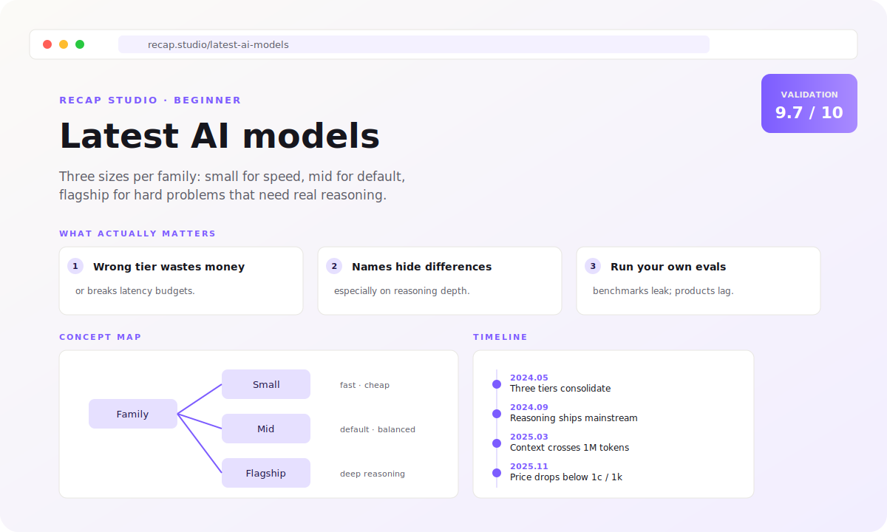
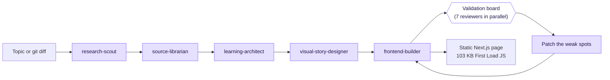

<picture>
  <source media="(prefers-color-scheme: dark)" srcset=".github/assets/logo-dark.svg">
  <source media="(prefers-color-scheme: light)" srcset=".github/assets/logo-light.svg">
  
</picture>

<p align="center">
  <a href="https://github.com/Aboudjem/recap-studio/releases/tag/v0.2.0"></a>
  <a href="LICENSE"></a>
  <a href="https://github.com/Aboudjem/recap-studio/actions/workflows/ci.yml"></a>
  <a href="https://nodejs.org"></a>
  <a href="https://github.com/Aboudjem/10x"></a>
  <a href="https://github.com/Aboudjem/recap-studio/stargazers"></a>
</p>

<p align="center"><b>Turn any topic or git diff into a cited, mobile-first one-page explainer in 5 minutes.</b></p>

<p align="center">
  <sub>13 specialist agents · 7-dimension validation · static Next.js output · 103 KB First Load JS · scored 9.7/10 on the demo</sub>
</p>

<p align="center">
  <a href="#install">Install</a> ·
  <a href="#see-it-in-action">See it</a> ·
  <a href="#what-you-get">What you get</a> ·
  <a href="#how-it-works">How it works</a> ·
  <a href="#commands">Commands</a> ·
  <a href="docs/architecture.md">Docs</a>
</p>

<picture>
  
</picture>

---

## Install

> [!TIP]
> The fastest path is the marketplace install. The clone path lets you customize the renderer.

**From the 10x marketplace (recommended):**

```bash
claude plugin marketplace add Aboudjem/10x
claude plugin install recap-studio@10x
```

Then in any Claude Code session:

```
/recap "Latest AI models"
```

**From source (for tweaking the renderer or running the demo locally):**

```bash
git clone https://github.com/Aboudjem/recap-studio
cd recap-studio
pnpm install
pnpm -w demo:latest-ai-models    # generate the offline demo page
pnpm -w validate:demo            # 7-dimension quality report
pnpm --filter recap-web dev      # http://localhost:3000
```

> [!NOTE]
> Recap Studio runs fully offline by default. The demo never makes a network call. No paid API key is required to try it.

---

## See it in action

The repo ships with a real, validated demo page for **"Latest AI models"** that you can open in 30 seconds:

```bash
pnpm -w demo:latest-ai-models && pnpm --filter recap-web dev
```

You get a one-page site with a hero one-sentence answer, three takeaway cards, a concept map, a key-ideas grid, a timeline, a comparison table, misconceptions, a glossary, takeaways, and source citations. Every claim links to a `sourceMap` entry.

> [!IMPORTANT]
> The demo page is generated from a fixture and is clearly labeled as such. Replace the fixture with a live research run by setting an API key and unsetting `RECAP_STUDIO_FIXTURE_ONLY`.

---

## What you get

| Section              | What it is for                                         |
| -------------------- | ------------------------------------------------------ |
| Hero                 | A one-sentence answer, not a marketing intro           |
| What matters         | Three takeaways, large type, above the fold            |
| Concept map          | A real diagram, never decoration                       |
| Key ideas            | Four to seven short cards, never paragraphs            |
| Timeline             | Only when there is real chronology to show             |
| Comparison           | Table on desktop, stacked cards on mobile              |
| Examples + analogies | Concrete first, abstractions second                    |
| Misconceptions       | Myth on the left, truth on the right                   |
| Glossary             | Plain-English definitions, collapsed by default        |
| Takeaways            | Things a reader can act on today                       |
| Sources              | Every important claim cites at least one entry         |
| Confidence notes     | Marks uncertainty instead of papering over it          |

> [!TIP]
> The page is mobile-first. It works at 360 px. No horizontal scroll. No hidden critical content.

---

## How it works



Thirteen specialist agents pass typed JSON. Each step is narrow. Reviewers run in parallel and only failing dimensions trigger another pass.

> [!NOTE]
> The 13 agents: research-scout, source-librarian, learning-architect, visual-story-designer, frontend-builder, repo-session-analyst, fact-checker, beginner-reviewer, accessibility-reviewer, ux-design-reviewer, performance-reviewer, security-privacy-reviewer, skeptical-reviewer. Full prompts under [`agents/`](agents/), architecture in [`docs/architecture.md`](docs/architecture.md).

---

## Quality bar

Every page must clear these targets. The demo scores **9.7 of 10** overall.

| Dimension        | Target | Demo  |
| ---------------- | :----: | :---: |
| Facts            |  ≥ 9   |  10   |
| Beginner clarity |  ≥ 9   |  10   |
| Accessibility    |  ≥ 9   |  10   |
| UX / design      |  ≥ 8   |  10   |
| Performance      |  ≥ 8   |   8   |
| Security         |  ≥ 9   |  10   |
| Simplicity       |  ≥ 9   |  10   |

> [!CAUTION]
> If a dimension drops, the validator marks it `WARN` or `FAIL`. The orchestrator runs a targeted patch pass before declaring done.

---

## Commands

| Command                              | What it does                                        |
| ------------------------------------ | --------------------------------------------------- |
| `pnpm -w demo:latest-ai-models`      | Generate the offline demo page                      |
| `pnpm -w validate:demo`              | Score the active page across 7 dimensions           |
| `pnpm -w history`                    | List every recap in `artifacts/` with scores        |
| `pnpm -w auto-refresh -- <slug>`     | Re-validate a stored recap (cron-friendly)          |
| `pnpm --filter recap-web dev`        | Preview the page on localhost:3000                  |
| `pnpm --filter recap-web build`      | Build the static site                               |
| `pnpm deploy:preview`                | Vercel preview deploy (gated by config + env)       |
| `pnpm deploy:prod`                   | Vercel production deploy (double-gated)             |

In Claude Code:

| Command                  | What it does                                          |
| ------------------------ | ----------------------------------------------------- |
| `/recap "<topic>"`       | Build a full explainer page from a topic              |
| `/recap session`         | Explain a coding session from `git diff` and commits  |
| `/recap session --deep`  | Same, with a per-file deep-dive accordion             |
| `/recap setup`           | Create `recap-studio.config.ts` with safe defaults    |
| `/recap validate`        | Re-score the active page                              |

---

## Safety defaults

> [!WARNING]
> Every side effect is off by default. Recap Studio refuses to deploy, email, or write secrets without explicit opt-in.

- No network. `RECAP_STUDIO_FIXTURE_ONLY=1` is the canonical starting state.
- No deploys. `deploymentMode: "disabled"`.
- No emails. `emailMode: "disabled"`.
- No secret writes. Hooks refuse `.env*`, PEMs, and key-shaped paths.
- No destructive git. Hooks refuse `push`, `reset --hard`, `rebase`, `clean -fdx`.

Hook overrides exist for human-review situations and are documented in [`hooks/README.md`](hooks/README.md). See [`docs/security-and-privacy.md`](docs/security-and-privacy.md) for the threat model.

---

## v0.2 features

| Feature              | What it adds                                                       |
| -------------------- | ------------------------------------------------------------------ |
| History dashboard    | `pnpm -w history` lists every recap with score and blockers        |
| Multi-language       | Six locales pre-wired (en, fr, es, de, pt, ja) for UI chrome       |
| RAG source vault     | Keyword search across the JSONL source cache                       |
| Auto-refresh         | `pnpm -w auto-refresh -- <slug>` re-validates a recap on demand    |
| Template marketplace | `templates/` with `tech-explainer` and `coding-session`            |
| Human review mode    | `humanReviewMode: "off" \| "before-publish" \| "before-deploy"`    |
| Reader analytics     | Privacy-friendly local-only counters, opt-in                       |

---

## Docs

- [Architecture](docs/architecture.md)
- [Agent system](docs/agent-system.md)
- [Workflows](docs/workflows.md)
- [Vercel deployment](docs/vercel-deployment.md)
- [Security and privacy](docs/security-and-privacy.md)
- [Configuration](docs/configuration.md)
- [Contributing](CONTRIBUTING.md)
- [Changelog](CHANGELOG.md)
- [GOAL_SPEC.md](GOAL_SPEC.md)

---

## Contributing

PRs welcome. The bar is high but the rules are short. See [CONTRIBUTING.md](CONTRIBUTING.md).

---

<p align="center">
  If Recap Studio helped you ship a better explainer, star it.<br/>
  It helps other devs find tools that respect their attention.
</p>

<p align="center">
  <a href="https://www.linkedin.com/in/adam-boudjemaa/"></a>
  <a href="https://x.com/AdamBoudj"></a>
  <a href="https://adam-boudjemaa.com/"></a>
</p>

<p align="center">
  <sub>Built by <a href="https://github.com/Aboudjem">Adam Boudjemaa</a> · MIT License · No telemetry · No data collection</sub>
</p>
